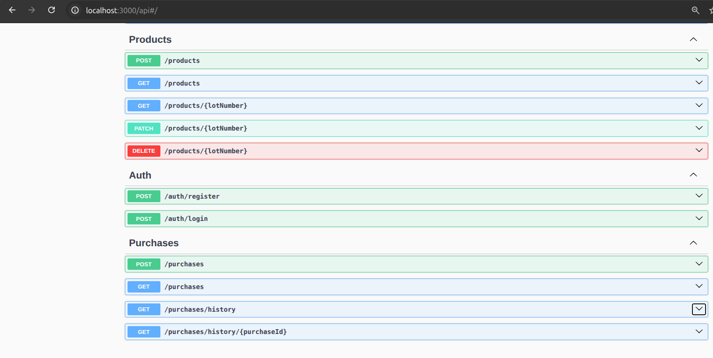
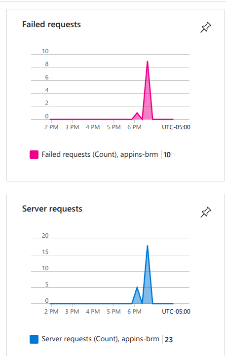
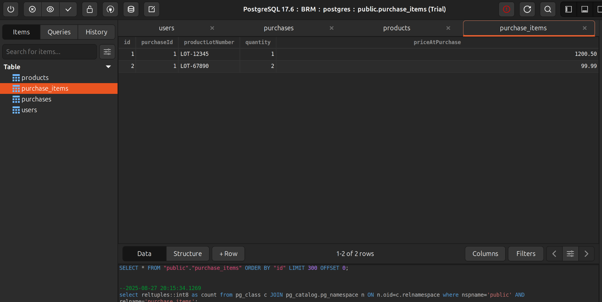

# **Documento de Instrucciones del Software**

## **Características Principales**

* **Gestión de Usuarios y Roles:** El sistema permite el registro de usuarios con dos roles principales: **Cliente** (para realizar compras) y **Administrador** (para gestionar productos y ver reportes de ventas).
* **Autenticación y Seguridad:** El acceso a las funcionalidades está protegido mediante autenticación con JSON Web Tokens (**JWT**). Las rutas están resguardadas con Guards que verifican tanto la autenticación como el rol del usuario para conceder acceso.
* **Catálogo de Productos:** Los usuarios con rol de **Administrador** pueden gestionar los productos en el inventario, incluyendo la adición, actualización y eliminación de artículos.
* **Módulo de Compras:** Los **clientes** pueden realizar compras, lo que automáticamente actualiza el inventario disponible. La lógica de negocio utiliza transacciones para asegurar que las compras solo se completen si hay suficiente stock para todos los productos.
* **Historial de Compras:** Los **clientes** pueden consultar su historial de compras y ver los detalles de sus facturas.
* **Reportes de Ventas:** Los **Administradores** tienen acceso a un reporte que muestra todas las compras realizadas en el sistema.
* **Monitoreo y Telemetría:** El software está configurado para enviar datos de telemetría a **Azure Application Insights** a través de **OpenTelemetry**. Esto permite monitorear el rendimiento, identificar errores en las solicitudes y consultar logs detallados.

## **Stack Técnico**

Este software se ha construido utilizando las siguientes tecnologías:

* **Backend:** [Node.js](https://nodejs.org/) con el framework [NestJS](https://nestjs.com/) (el cual funciona por debajo con express.js).
* **Base de datos:** [PostgreSQL](https://www.postgresql.org/).
* **ORM (Mapeador de Objetos-Relacional):** [Sequelize](https://sequelize.org/) y [Sequelize TypeScript](https://sequelize.org/docs/v6/other-topics/typescript/).
* **Autenticación:** [JWT (JSON Web Tokens)](https://jwt.io/).
* **Monitoreo:** [OpenTelemetry](https://opentelemetry.io/) para la recolección de telemetría, enviada a [Azure Application Insights](https://azure.microsoft.com/en-us/services/monitor/) para su análisis.

## **Instrucciones de Configuración y Uso**

### **1\. Configuración de Entorno**

Se tienen dos dependencias externas, una Base de datos PostgreSQL y una instancia de Azure APPLICATION INSIGHTS (servicio de la nube Azure).
Antes de iniciar el servidor, asegúrate de tener las siguientes variables de entorno en un archivo .env en la raíz de tu proyecto:

* `DB_HOST` Host de tu base de datos (ej. localhost).
* `DB_PORT` Puerto de tu base de datos (ej. 5432).
* `DB_USER` Nombre de usuario de la base de datos.
* `DB_PASSWORD` Contraseña del usuario de la base de datos.
* `DB_DATABASE` Nombre de la base de datos.
* `JWT_SECRET` Una clave secreta para firmar los tokens JWT.
* `APPLICATIONINSIGHTS_CONNECTION_STRING` Cadena de conexión de Azure Application Insights.

### **2\. Ejecución de la Aplicación**

Para iniciar el servidor NestJS en modo de desarrollo, ejecuta el siguiente comando:

npm run start

### **3\. Uso del API**

Una vez que el servidor esté en funcionamiento, puedes interactuar con las siguientes rutas:

#### **Autenticación**

* POST /auth/register: Permite a los nuevos usuarios registrarse con un nombre de usuario y contraseña.
* POST /auth/login: Permite a los usuarios autenticarse para recibir un token JWT.

#### **Productos (Rol: Administrador)**

* POST /products: Crea un nuevo producto.
* GET /products: Obtiene la lista de todos los productos.
* GET /products/:id: Obtiene un producto por su ID.
* PUT /products/:id: Actualiza un producto existente.
* DELETE /products/:id: Elimina un producto.

#### **Compras (Rol: Cliente y Administrador)**

* POST /purchases: Permite a un **cliente** realizar una compra. El cuerpo de la solicitud debe ser un array de objetos con productLotNumber y quantity.
* GET /purchases/history: Permite a un **cliente** ver su historial de compras.
* GET /purchases/history/:purchaseId: Permite a un **cliente** ver los detalles de una factura específica.
* GET /purchases: Permite a un **administrador** ver todas las compras.

### **4\. Monitoreo con Azure Application Insights**

La integración con **Azure Application Insights** está configurada para recopilar automáticamente telemetría sobre las solicitudes HTTP entrantes, las dependencias de la base de datos y los logs. Puedes ver los siguientes datos en el portal de Azure:

* **Rendimiento de las Solicitudes:** Identifica las rutas que tienen un rendimiento lento.
* **Fallos en las Solicitudes:** Recibe notificaciones sobre las solicitudes que fallan.
* **Métricas de la Base de Datos:** Observa el tiempo de respuesta de las consultas a la base de datos.
* **Logs Personalizados:** Los mensajes de log generados por la aplicación pueden ser consultados para el diagnóstico.

### **Notas Adicionales**

* **Base de Datos**: La configuración synchronize: true de Sequelize es adecuada para desarrollo, ya que crea las tablas automáticamente. Para un entorno de producción, se recomienda usar migraciones para gestionar los cambios en el esquema de la base de datos.
* **Validación de Datos**: La aplicación utiliza class-validator para asegurar que los datos de entrada a las rutas cumplan con las reglas de negocio, lo que previene errores y mejora la seguridad.

## Pruebas fotograficas
### rutas

### metricas

### DB

